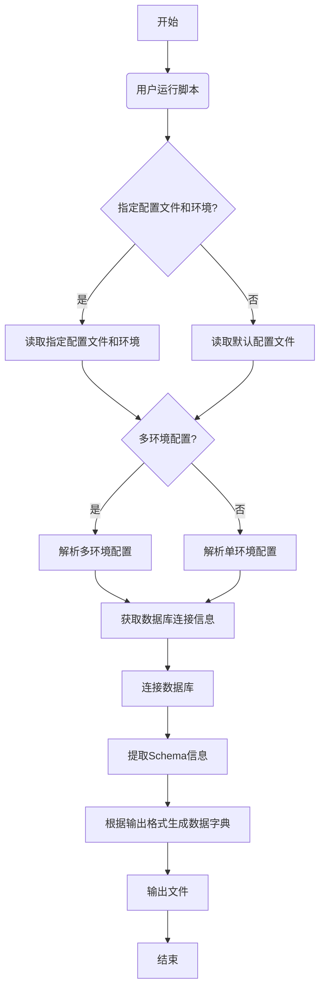

# 数据字典生成工具

这个工具可以从各种数据库中提取表结构信息，并生成易于浏览的数据字典文档。

## 功能特点

- 支持多种数据库：SQL Server、MySQL、PostgreSQL、Oracle
- 支持多种输出格式：Markdown、Excel、HTML、交互式HTML、CSV
- 交互式HTML格式提供搜索功能，方便快速查找表和字段
- 支持表过滤，可以只生成指定表的数据字典
- 支持多数据库环境配置管理

## 安装依赖

```bash
pip install -r requirements.txt
```

## 基本用法

```bash
# 使用默认配置
python generate_data_dictionary.py

# 指定输出格式
python generate_data_dictionary.py --output-format interactive-html

# 测试数据库连接
python generate_data_dictionary.py --test-connection

# 只包含特定表
python generate_data_dictionary.py --include-tables table1,table2,table3

# 排除特定表
python generate_data_dictionary.py --exclude-tables log_,tmp_
```

### 增量同步功能

- 只同步/生成指定表的数据字典，极大降低数据库压力。
- 支持文件增量管理、智能合并、状态检查、团队协作。

**常用命令：**

```bash
# 查看当前增量表文件内容
python generate_data_dictionary.py --show-incremental-file

# 检查增量同步状态
python generate_data_dictionary.py --show-incremental-status

# 编辑增量表文件（如 incremental_tables.txt），添加需同步的表名
vim incremental_tables.txt

# 执行增量同步
python generate_data_dictionary.py --incremental --output-format interactive-html
```

**高级用法：**
- 支持自定义增量表文件
- 支持多环境配置与输出文件名
- 支持清空增量表文件

详见下方“增量同步典型场景”与“高级用法”部分。

### 搜索功能

- 搜索功能仅为前端交互式HTML页面内的筛选与高亮，命令行工具本身不支持 --search-keyword 或 --search-mode 参数。
- 在生成的交互式HTML文档中，可通过页面内的搜索框进行表名、字段名、注释等内容的实时筛选和高亮。

**推荐场景：**
- 数据表数量较多时，建议使用 interactive-html 格式，方便在浏览器中通过页面自带的搜索功能进行精准筛选。

## 常用指令示例

### 1. 生成生产环境（sqlserver-prod）的完整数据字典

```bash
python generate_data_dictionary.py --config config_multi_env.ini --env sqlserver-prod
```

### 2. 对生产环境（sqlserver-prod）进行增量更新

此操作会读取 `incremental_tables.txt` 文件，只更新其中列出的表。

```bash
python generate_data_dictionary.py --config config_multi_env.ini --env sqlserver-prod --incremental
```

## 工作流程

以下是数据字典生成脚本的工作流程图：



## 配置文件

工具使用`config.ini`文件进行配置，示例如下：

```ini
[database]
type = sqlserver
host = localhost
port = 1433
database = my_database
user = username
password = password
driver = SQL Server

[output]
format = interactive-html
filename = 
```

## 多数据库环境管理

工具支持两种方式管理多个数据库环境：使用多个配置文件或在单个配置文件中定义多个环境。这两种方式都支持不同类型的数据库（SQL Server、MySQL、PostgreSQL、Oracle）。

### 方案1：多配置文件

为每个数据库环境创建单独的配置文件，适合管理不同类型的数据库：

```bash
# 使用SQL Server数据库配置
python generate_data_dictionary.py --config config_sqlserver.ini

# 使用PostgreSQL数据库配置
python generate_data_dictionary.py --config config_pgsql.ini
```

配置文件示例（SQL Server）：
```ini
[database]
type = sqlserver
host = localhost
port = 1433
database = my_sqlserver_db
user = sqlserver_user
password = password123
driver = SQL Server

[output]
format = interactive-html
filename = 
```

配置文件示例（PostgreSQL）：
```ini
[database]
type = postgresql
host = 192.168.1.100
port = 5432
database = my_pgsql_db
user = pgsql_user
password = password456

[output]
format = interactive-html
filename = 
```

### 方案2：多环境配置文件

使用`multi_db_support.py`模块，在单个配置文件中定义多个环境，可以包含不同类型的数据库：

```bash
# 查看所有可用环境
python generate_data_dictionary.py --config config_multi_env.ini --list-env

# 使用指定环境（如生产环境 sqlserver-prod）生成数据字典
python generate_data_dictionary.py --config config_multi_env.ini --env sqlserver-prod
```

多环境配置文件示例（包含不同类型的数据库）：

```ini
[environment]
default = sqlserver

[database:sqlserver]
type = sqlserver
host = localhost
port = 1433
database = my_sqlserver_db
user = sqlserver_user
password = password123
driver = SQL Server

[database:postgresql]
type = postgresql
host = 192.168.1.100
port = 5432
database = my_pgsql_db
user = pgsql_user
password = password456

[output]
format = interactive-html
filename = 
```

## 输出格式说明

- **markdown**: 生成单个Markdown文件
- **excel**: 生成Excel文件，每个表一个工作表
- **html**: 生成HTML文件，适合在浏览器中查看
- **interactive-html**: 生成交互式HTML文件，带有搜索功能（推荐）
- **csv**: 生成CSV文件

## 注意事项

- 对于大型数据库（表数量超过100个），建议使用interactive-html格式
- 所有输出文件会放在以数据库信息命名的文件夹中，方便管理
- 密码信息存储在配置文件中，请确保配置文件的安全性

## 数据库注释维护SQL

为了方便您维护数据库中的表和字段注释，以下是 PostgreSQL 和 SQL Server 中常用的SQL语句。

### PostgreSQL

在 PostgreSQL 中，您可以使用 `COMMENT ON` 语句来添加或修改注释。

- **为表添加注释**

  ```sql
  COMMENT ON TABLE your_schema_name.your_table_name IS '这是表的注释';
  ```

- **为字段添加注释**

  ```sql
  COMMENT ON COLUMN your_schema_name.your_table_name.your_column_name IS '这是字段的注释';
  ```

### SQL Server

在 SQL Server 中，您需要使用系统存储过程 `sp_addextendedproperty` 和 `sp_updateextendedproperty` 来管理注释（扩展属性）。

- **为表添加/更新注释**

  如果注释不存在，则添加；如果已存在，则更新。

  ```sql
  -- 检查注释是否存在
  IF NOT EXISTS (SELECT 1 FROM sys.extended_properties WHERE major_id = OBJECT_ID('your_schema_name.your_table_name') AND name = 'MS_Description' AND minor_id = 0)
      -- 添加注释
      EXEC sp_addextendedproperty 
      @name = N'MS_Description', 
      @value = N'这是表的注释', 
      @level0type = N'SCHEMA', @level0name = N'your_schema_name', 
      @level1type = N'TABLE',  @level1name = N'your_table_name';
  ELSE
      -- 更新注释
      EXEC sp_updateextendedproperty 
      @name = N'MS_Description', 
      @value = N'这是更新后的表注释', 
      @level0type = N'SCHEMA', @level0name = N'your_schema_name', 
      @level1type = N'TABLE',  @level1name = N'your_table_name';
  GO
  ```

- **为字段添加/更新注释**

  如果注释不存在，则添加；如果已存在，则更新。

  ```sql
  -- 检查注释是否存在
  IF NOT EXISTS (SELECT 1 FROM sys.fn_listextendedproperty(N'MS_Description', 'SCHEMA', 'your_schema_name', 'TABLE', 'your_table_name', 'COLUMN', 'your_column_name'))
      -- 添加注释
      EXEC sp_addextendedproperty 
      @name = N'MS_Description', 
      @value = N'这是字段的注释', 
      @level0type = N'SCHEMA', @level0name = N'your_schema_name', 
      @level1type = N'TABLE',  @level1name = N'your_table_name', 
      @level2type = N'COLUMN', @level2name = N'your_column_name';
  ELSE
      -- 更新注释
      EXEC sp_updateextendedproperty 
      @name = N'MS_Description', 
      @value = N'这是更新后的字段注释', 
      @level0type = N'SCHEMA', @level0name = N'your_schema_name', 
      @level1type = N'TABLE',  @level1name = N'your_table_name', 
      @level2type = N'COLUMN', @level2name = N'your_column_name';
  GO
  ```

**注意**: 在使用时，请将 `your_schema_name`、`your_table_name` 和 `your_column_name` 替换为您的实际架构名、表名和字段名。在 SQL Server 中，默认的 schema 通常是 `dbo`。
